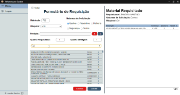
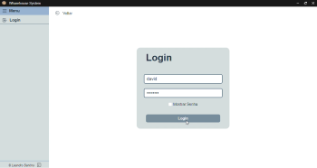
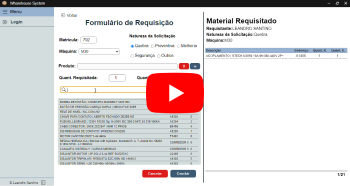

# WarehouseSystem

O WarehouseSystem é um sistema de gestão de estoque, ele foi projetado para
atender a demanda de um almoxarifado de manutenção, o programa fornece a
possibilidade de registrar saídas e entradas de itens no estoque, permite a
emissão de requisições de saídas, uma interface para controle do estoque e
permite registar contagens de inventário através de um aplicativo móvel.

 

Ele foi construído utilizando o ElectronJs para criar um aplicativo nativo para
o windows, toda aparte visual foi construída com html, css e javascript.
Utilizei o “Ejs” parar criar navegação de página e o “Sass” para facilitar a
estilização.

## Funcionalidades

- Criar requisições
- Gerar PDF;
- Gerenciar requisições(admin):
  - Criar;
  - Excluir;
- Estoque(admin):
  - Pesquisar;
  - Modificar;
- Pesquisar Itens;

## Aprendizados

[em aberto]

## Veja o WarehouseSystem funcionando

#### Link para o Repostório

[github.com/leandrosantino/warehouseSystem](https://github.com/leandrosantino/warehouseSystem)

#### Post no Linkedin

[Linkedin - LeandroSantino_warehouseSystem](https://www.linkedin.com/posts/leandro-santino-7b2717215_warehousesystem-este-%C3%A9-mais-um-dos-meus-activity-7080716477800026112-Q8rO?utm_source=share&utm_medium=member_desktop)

## Licença

MIT
